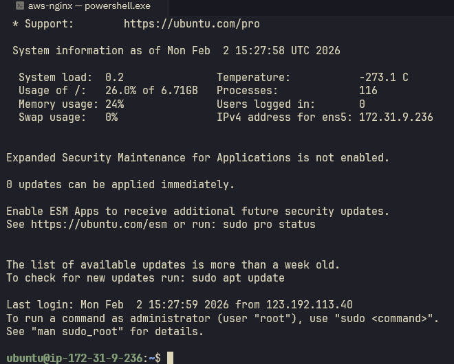
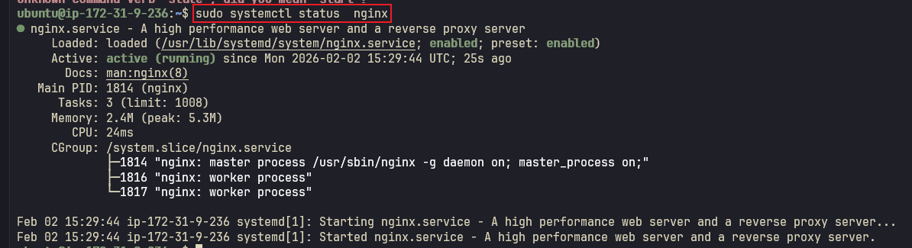
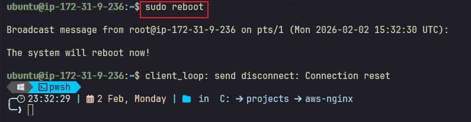
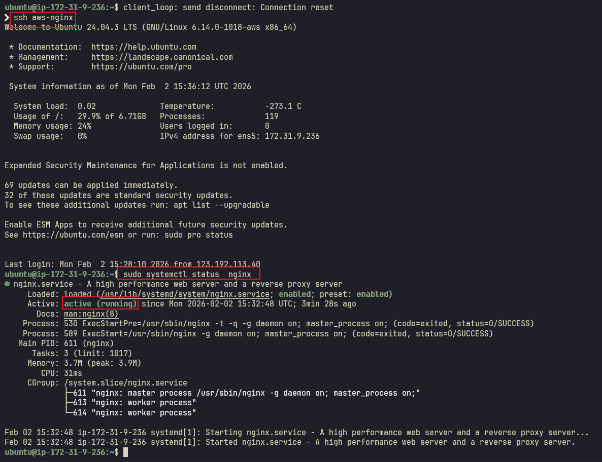
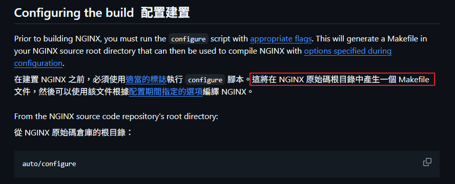
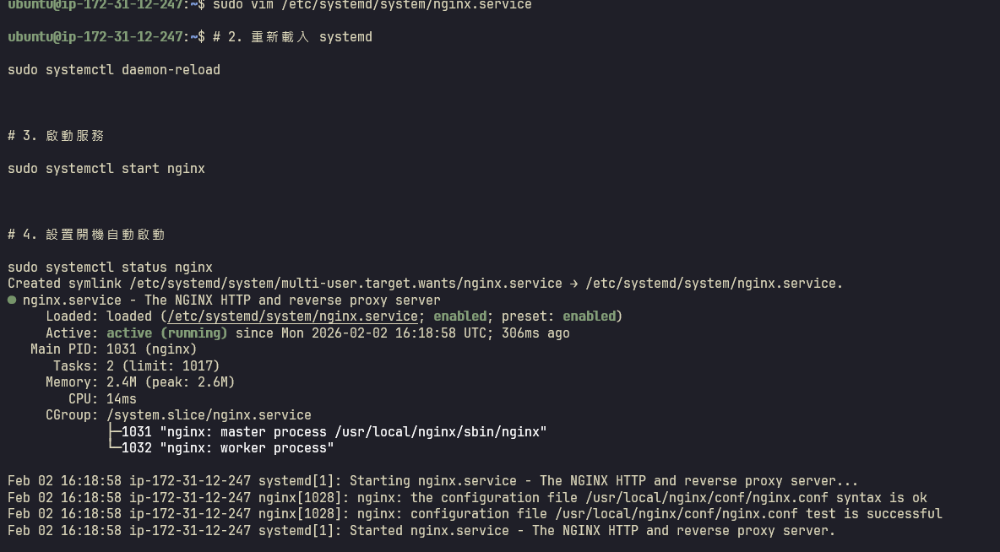
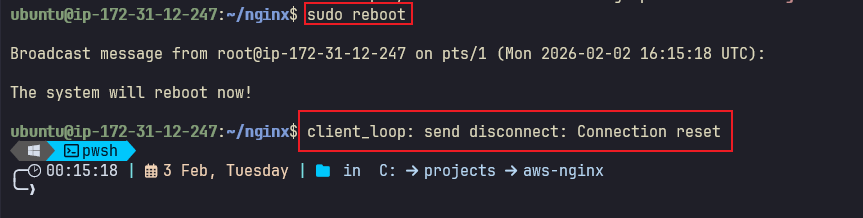
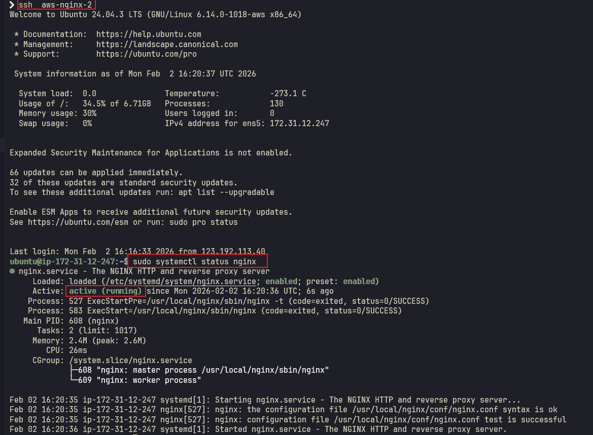

# AWS Nginx 安裝指南

本專案說明如何在 AWS EC2 上安裝和配置 Nginx，提供兩種安裝方式：套件管理器安裝和原始碼編譯安裝。

## 目錄

- [方法一：使用套件管理器安裝 Nginx](#方法一使用套件管理器安裝-nginx)
- [方法二：從原始碼編譯安裝 Nginx](#方法二從原始碼編譯安裝-nginx)

---

## 方法一：使用套件管理器安裝 Nginx

### 前置需求
- AWS EC2 實例（Ubuntu/Debian）
- SSH 連線權限



### 步驟 1：連線到 EC2 並安裝 Nginx

```bash
# 更新套件庫
sudo apt update

# 安裝 Nginx
sudo apt install nginx -y

# 啟動 Nginx 服務
sudo systemctl start nginx

# 設定開機自動啟動
sudo systemctl enable nginx
```

### 步驟 2：查看 Nginx 服務狀態

```bash
sudo systemctl status nginx
```



### 步驟 3：驗證自動啟動功能

重啟 EC2 實例以驗證 Nginx 是否會自動啟動：

```bash
sudo reboot
```



### 步驟 4：確認 Nginx 已自動重啟

重新連線後，檢查 Nginx 服務狀態：

```bash
sudo systemctl status nginx
```



---

## 方法二：從原始碼編譯安裝 Nginx

### 前置需求
- AWS EC2 實例（Ubuntu/Debian）
- 編譯工具和相依套件

### 步驟 1：連線到第二台 EC2


### 步驟 2：取得 Nginx 原始碼

Nginx 官方開源專案：[https://github.com/nginx/nginx](https://github.com/nginx/nginx)

參考文件：點擊 **Build nginx from source**


### 步驟 3：安裝編譯相依套件

```bash
# 更新套件庫
sudo apt update

# 安裝編譯工具
sudo apt install gcc make -y

# 安裝 Nginx 相依套件
sudo apt install libpcre3-dev zlib1g-dev -y
```

### 步驟 4：下載並編譯 Nginx

```bash
# 下載 Nginx 原始碼
git clone https://github.com/nginx/nginx.git

# 進入目錄
cd nginx

# 配置編譯選項
auto/configure

# 編譯
make

# 安裝
sudo make install
```

> **注意**  
> 執行完 `auto/configure` 後，會在當前目錄產生 `Makefile` 檔案，用於後續的編譯流程。




### 步驟 5：設定 Nginx 為系統服務

#### 5.1 創建 systemd 服務檔案
如果要設定開機自啟動的服務，建議使用 `systemctl` 指令。`systemctl` 是 systemd 系統初始化程式的控制命令，用於管理 Linux 系統上的服務

```bash
# 配置 Nginx 服務
sudo vim /etc/systemd/system/nginx.service
```

#### 5.2 加入以下內容

```ini
[Unit]
# 描述服務
Description=The NGINX HTTP and reverse proxy server

# 依賴關係，等待網路初始化後再行動
After=network.target

[Service]
# Nginx 服務使用 fork 模式運行
Type=forking
PIDFile=/usr/local/nginx/logs/nginx.pid

# 啟動前檢查配置文件語法 
ExecStartPre=/usr/local/nginx/sbin/nginx -t

# 啟動 Nginx 服務
ExecStart=/usr/local/nginx/sbin/nginx

# 重新加載 Nginx 配置
ExecReload=/usr/local/nginx/sbin/nginx -s reload

# 停止 Nginx 服務
ExecStop=/bin/kill -s QUIT $MAINPID

# 私有化 TMP 目錄
PrivateTmp=true

[Install]
# 定義開機自啟的目標
WantedBy=multi-user.target
```

#### 5.3 啟用並啟動服務

```bash
# 重新載入 systemd 配置
sudo systemctl daemon-reload

# 啟動 Nginx 服務
sudo systemctl start nginx

# 設定開機自動啟動
sudo systemctl enable nginx

# 檢查服務狀態
sudo systemctl status nginx
```



### 步驟 6：驗證自動啟動功能

重啟 EC2 實例：

```bash
sudo reboot
```



### 步驟 7：確認服務運行狀態

重新連線後，檢查 Nginx 是否已自動啟動：

```bash
sudo systemctl status nginx
```



---

## 總結

本指南提供了兩種在 AWS EC2 上安裝 Nginx 的方法：

1. **套件管理器安裝**：快速簡便，適合大多數使用情境
2. **原始碼編譯安裝**：提供更多自訂選項，適合進階使用者

兩種方法都已設定為開機自動啟動，確保服務的高可用性。

## 相關資源

- [Nginx 官方網站](https://nginx.org/)
- [Nginx 官方文檔](https://nginx.org/en/docs/)
- [Nginx GitHub](https://github.com/nginx/nginx)
